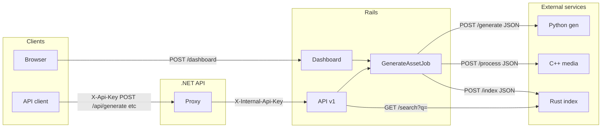

# Data flow (current contracts)

This document summarizes **who calls whom** and **which contract** is used. For the full system diagram and runbook narrative, see [../data-flow.md](../data-flow.md).

## Client → Rails

- **Dashboard (browser)**: POST `/dashboard` with `generation_job[prompt]`. Creates a job, enqueues `GenerateAssetJob`, redirects. Rate-limited per IP.
- **Internal API (e.g. .NET proxy or direct)**: POST `/api/v1/generate` with JSON `{ "prompt": "..." }` → 201 `{ "job_id", "status": "queued" }`. Poll GET `/api/v1/jobs/:id` for status; GET `/api/v1/assets` and `/api/v1/assets/:id` for results. Auth: `X-Internal-Api-Key` when `RAILS_INTERNAL_API_KEY` is set.

## Client → .NET API

- **External API clients**: POST `/api/generate` (body `{ "prompt": "..." }`), GET `/api/assets?search=...`, GET `/api/assets/{id}`. Auth: `X-Api-Key`. .NET forwards to Rails with `X-Internal-Api-Key` and `X-Correlation-Id` (or `X-Request-Id`). Request/response JSON matches [Rails API](rails-api.md).

## Rails worker (GenerateAssetJob) → external services

The worker runs after a job is created (dashboard or API). It performs, in order:

1. **Python gen** (always, when generator is configured)
   - **Contract**: [python-gen.md](python-gen.md)
   - POST `{GENERATOR_URL}/generate`, headers: `Content-Type: application/json`, `Accept: application/json`, `X-Correlation-Id`.
   - Body: `{ "prompt": "<job.prompt>" }`.
   - Expects: 200 JSON `{ "image_base64", "seed", "model" }`. Decodes image, stores in Active Storage, creates Asset with metadata.

2. **C++ media** (optional, when `CPP_MEDIA_URL` is set)
   - **Contract**: [cpp-media.md](cpp-media.md)
   - POST `{CPP_MEDIA_URL}/process`, headers: `Content-Type: application/json`, `Accept: application/json`, `X-Correlation-Id`.
   - Body: `{ "image_base64", "thumbnail_size": 256, "resize_max": 1200, "output_format": "jpg", "operations": "thumbnail,resize" }`.
   - Expects: 200 JSON with `thumbnail_base64`, `thumbnail_content_type`. Attaches thumbnail to Asset.
   - If `CPP_MEDIA_URL` is blank but `MEDIA_SERVICE_COMMAND` is set: runs CLI with env `INPUT_PATH`, `ASSET_ID`, `PROMPT` (no thumbnail).

3. **Rust index** (optional, when `INDEX_SERVICE_URL` is set)
   - **Contract**: [rust-index.md](rust-index.md)
   - POST `{INDEX_SERVICE_URL}/index`, headers: `Content-Type: application/json`, `Accept: application/json`, `X-Correlation-Id`.
   - Body: `{ "asset_id": "<asset.id>", "prompt": "<job.prompt>", "metadata": <asset.metadata>, "tags": [] }`.
   - Expects: 204 No Content.
   - If `INDEX_SERVICE_URL` is blank but `INDEX_SERVICE_COMMAND` is set: runs CLI with env `ASSET_ID`, `PROMPT`.

Rails **asset library** (when `INDEX_SERVICE_URL` is set): GET `{INDEX_SERVICE_URL}/search?q=<query>` → `{ "asset_ids": [...] }` → filters displayed assets to those IDs (scoped to current user).

## Diagram (simplified)

See [../data-flow.md](../data-flow.md) for the full diagram including DB, Sidekiq, rate limit, and asset library.
