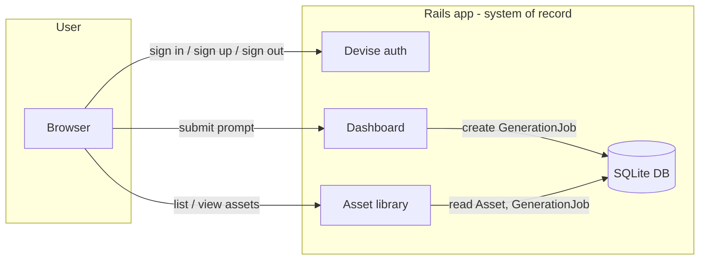

# Data flow

This diagram is updated as the project evolves. Rails is the system of record and the user-facing product.

**Current state:** Users log in via Devise, submit prompts on the dashboard (creating `GenerationJob` records in the DB), and can open the asset library and asset detail pages. No image generation or file storage yet; no inter-service calls to Python gen, C++ media, Rust index, or .NET API. Update this document when you add generation pipelines, APIs, or shared data flows.
