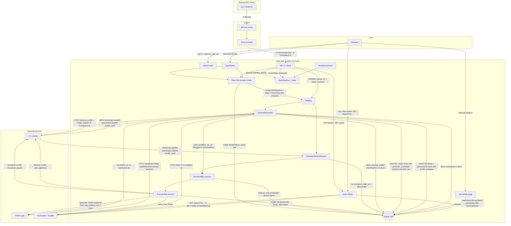

# Data flow

This diagram is updated as the project evolves. Rails is the system of record and the user-facing product. Orchestration is workflow-centric and **step-based**: every run is a **WorkflowRun** with **WorkflowRunSteps**; **OrchestrateWorkflowJob** delegates to **Workflows::RunWorkflow**, which executes steps in order via **Workflows::ExecuteStep** (generate → thumbnail → process → index). The legacy path creates a default WorkflowRun + GenerationJob and enqueues **GenerateAssetJob** (which delegates to RunWorkflow when the job has a workflow_run_id).

**Two entry paths:**

1. **Wrapped path (backward compatible):** Dashboard or API `POST /api/v1/generate` without `workflow_id`/`workflow_slug`. Rails creates a default **WorkflowRun** (preset `generate_process_index`) and **WorkflowRunSteps**, then a **GenerationJob** linked to the run, and enqueues **GenerateAssetJob**. The worker runs the full pipeline and on completion/failure updates the WorkflowRun and WorkflowRunSteps. Response: `{ job_id, status: "queued" }`.

2. **Workflow path:** API `POST /api/v1/generate` with `workflow_id` or `workflow_slug`. Rails creates a **WorkflowRun** and **WorkflowRunSteps** (status `queued`) from the chosen workflow, enqueues **OrchestrateWorkflowJob**. The job calls **Workflows::RunWorkflow**, which loads steps in execution order, **skips steps already completed** (retry-safe), and for each step calls **Workflows::ExecuteStep**. Step types: **generate** (Python generation + store image, sets run.asset_id), **thumbnail**, **process** (both call C++ `/process`), **index** (Rust `/index`). Each WorkflowRunStep stores status (`queued` → `running` → `completed` | `failed`), `started_at`, `completed_at`, `error_message`, and `output` (JSON: for generate steps includes asset_id, generation_job_id, backend, model, duration_ms, seed). On first step failure the run is marked failed and execution stops. Correlation ID is preserved on the run and any created GenerationJob. Response: `{ workflow_run_id, status: "queued" }`.

**Workflow presets (seeded):** `generate_only`, `generate_thumbnail`, `generate_process_index`. Steps use only the four step types (generate, thumbnail, process, index); generate includes storing the image. Run `bin/rails db:seed` to create them.

**External API (C#):** The `dotnet_api` service is the **public API gateway**. Clients send requests with header `X-Api-Key`; the C# API validates the key (from config `ApiKey` or env `ASPNETCORE_API_KEY`) and proxies to Rails, forwarding `X-Correlation-Id` (or `X-Request-Id`) when calling Rails. When `RAILS_INTERNAL_API_KEY` is set, Rails expects header `X-Internal-Api-Key` on internal API requests. **Ownership:** .NET handles public auth, validation, and response shaping; Rails remains the source of truth for workflows, jobs, and assets. C# endpoints: `POST /api/v1/generate` → Rails `POST /api/v1/generate`; `GET /api/v1/jobs/{id}` → Rails `GET /api/v1/jobs/:id`; `GET /api/v1/assets` and `GET /api/v1/search` (query `q` or `search`) → Rails `GET /api/v1/assets`; `GET /api/v1/assets/{id}` → Rails `GET /api/v1/assets/:id`. Rails remains the system of record; generation still goes through Rails job → Python → store asset.

**Rate limiting:** Prompt creation (`POST /api/v1/generate` and `POST /dashboard`) is throttled per IP (default 30 requests per minute). Configure with `RACK_ATTACK_THROTTLE_LIMIT`. Throttled API requests receive 429 with JSON `{ "error": "Rate limit exceeded" }`.

**Correlation id / request tracing:** When a job or workflow run is created (API or dashboard), Rails stores the request’s `request_id` as `correlation_id` (on GenerationJob or WorkflowRun). The workers log it and send header `X-Correlation-Id` on all outbound HTTP calls to the Python generator, C++ media, and Rust index. The asset library (web and API) also sends `X-Correlation-Id` on every call to the index service (`GET /ready` and `GET /search`). Each service logs the header and returns it in error response bodies so logs can be correlated across the stack.

**Observability:** All services emit **structured logs** (JSON or key=value) with timestamp, service name, level, correlation_id when present, and message (see `docs/observability.md`). Rails provides an **admin health dashboard** (`GET /admin/health`): it probes `GET /health` on Python (generator_url), C++ (cpp_media_url), Rust (index_service_url), and .NET (dotnet_api_url when `DOTNET_API_URL` is set) and shows status and last-checked time. **Workflow run detail** (`GET /workflow_runs/:id`) shows step-by-step status, duration per step, output metadata, error messages, and correlation ID. **Recent failures** (`GET /admin/failures`) lists failed workflow runs and failed legacy generation jobs with correlation_id and links to run/job detail for debugging.

**Job details and API:** The dashboard lists recent jobs with a **View job** link to `/jobs/:id` (Job details page), which shows full status, prompt, timestamps, and **full error_message** when failed. API clients can poll `GET /api/v1/jobs/:id` (same auth as other API) for `{ job_id, status, error_message?, created_at, started_at, completed_at, asset_id? }`.

**Current state:** Users log in via Devise and submit prompts on the dashboard. A **WorkflowRun** (default preset) and **WorkflowRunSteps** (status `queued`) are created, then a **GenerationJob** with status `queued` and `correlation_id` set from the request; **GenerateAssetJob** is enqueued in Sidekiq (Redis). When the job has a **workflow_run_id**, it delegates to **Workflows::RunWorkflow** (same step-based engine as OrchestrateWorkflowJob) and syncs job status from the run. When the job has no workflow_run (legacy), the worker runs the full pipeline inline: marks the job `running`, logs `correlation_id`, calls the Python generator service (HTTP POST to `/generate` with `Accept: application/json` and `X-Correlation-Id`), receives JSON `{ image_base64, seed, model, backend, duration_ms }`, decodes the image, stores it in Active Storage, creates an `Asset` with generator_metadata (seed, model, backend, duration_ms) in the Asset’s `metadata` column. If `CPP_MEDIA_URL` is set, the worker calls the C++ media service with a **profile** (legacy path uses `web_optimized`; workflow **thumbnail** step uses `thumbnail_square`, **process** step uses `web_optimized`). The worker POSTs to `/process` with JSON `{ image_base64, profile }`; cpp_media returns `thumbnail_base64`, `thumbnail_content_type`, optional `processed_base64`/`processed_content_type`, and `profile_used`. The worker attaches the thumbnail to `asset.thumbnail` and, when present, the processed output to `asset.processed_files`, each with blob metadata `role` and `profile` so the UI can label variants. If `CPP_MEDIA_URL` is not set but `MEDIA_SERVICE_COMMAND` is set, the worker runs the C++ media command (CLI) with env `INPUT_PATH`, `ASSET_ID`, `PROMPT` (no thumbnail/processed attachment). The worker then optionally calls the Rust index service (with `X-Correlation-Id`): when `INDEX_SERVICE_URL` is set it POSTs to `/index` with JSON `{ asset_id, prompt, metadata, tags }`; when only `INDEX_SERVICE_COMMAND` is set it runs the CLI with env `ASSET_ID`, `PROMPT`. The job is marked `completed` or `failed` with `error_message`; the worker also updates the linked **WorkflowRun** and **WorkflowRunSteps** status. Timeouts and retries for outbound HTTP are configurable via ENV (see `.env.example`). Job statuses: queued → running → completed | failed. The asset library and asset detail pages read each Asset’s `file`, `thumbnail`, and `processed_files` from Active Storage; thumbnails and processed variants are displayed with profile labels when present. The API exposes `download_url`, `thumbnail_url`, and `processed_files` (array of `{ profile, download_url }`). **Rust index (search):** The index service persists data to SQLite (configurable via `INDEX_DATA_PATH`) so the index survives restarts. When `INDEX_SERVICE_URL` is set, the asset library and API use Rust as the **source of truth for search**: GET `/search?q=...` returns asset IDs and Rails filters the list accordingly. The service exposes GET `/ready` (returns 200 once the index is loaded at startup) and POST `/rebuild` (clears the index; Rails or ops can then re-POST all assets to `/index` for repair or full reindexing). When the index service is not configured, the asset library shows “Search is not configured” and lists all assets. The Rails internal API (`/api/v1/generate`, `POST` with optional `workflow_id`/`workflow_slug`, `/api/v1/jobs/:id`, `/api/v1/assets`, `/api/v1/assets/:id`) is used by the C# API and is scoped to a single API user (config `API_USER_ID` or first user when unset).
