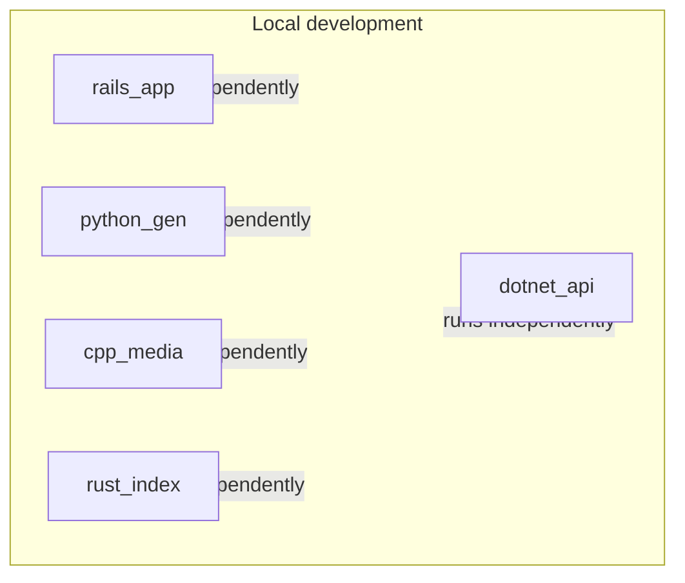

# Data flow

This diagram will be updated as the project evolves and real APIs or data flows are added between services. For now it describes the local dev setup: five independent components running on the same machine.

**Current state:** No inter-service calls. Each service is a "hello world" and can be started in any order from its own folder. Update this document when you add APIs, message queues, or shared data flows.
