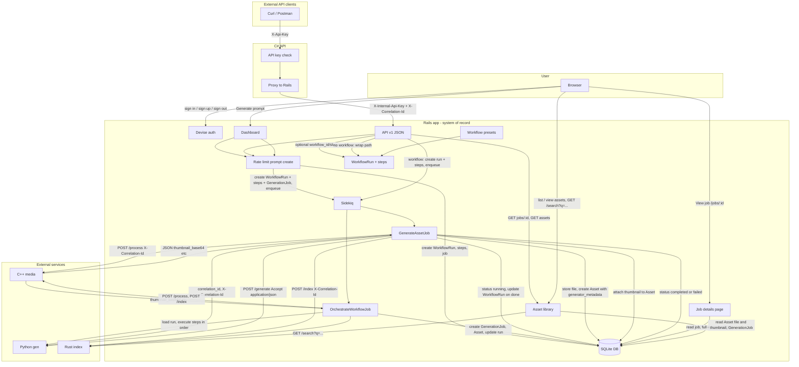

# Data flow

This diagram is updated as the project evolves. Rails is the system of record and the user-facing product. Orchestration is workflow-centric: every run is a **WorkflowRun**; the legacy path creates a default WorkflowRun + GenerationJob and enqueues **GenerateAssetJob**; the workflow path creates a WorkflowRun + WorkflowRunSteps and enqueues **OrchestrateWorkflowJob**.

**Two entry paths:**

1. **Wrapped path (backward compatible):** Dashboard or API `POST /api/v1/generate` without `workflow_id`/`workflow_slug`. Rails creates a default **WorkflowRun** (preset `generate_process_index`) and **WorkflowRunSteps**, then a **GenerationJob** linked to the run, and enqueues **GenerateAssetJob**. The worker runs the full pipeline and on completion/failure updates the WorkflowRun and WorkflowRunSteps. Response: `{ job_id, status: "queued" }`.

2. **Workflow path:** API `POST /api/v1/generate` with `workflow_id` or `workflow_slug`. Rails creates a **WorkflowRun** and **WorkflowRunSteps** from the chosen workflow, enqueues **OrchestrateWorkflowJob**. The job executes each step in order (generate → store → thumbnail → index) and updates run/step status. No GenerationJob is created in the controller; the orchestration job creates one when it runs the generate step. Response: `{ workflow_run_id, status: "queued" }`.

**Workflow presets (seeded):** `generate_only`, `generate_thumbnail`, `generate_process_index`. Run `bin/rails db:seed` to create them.

**External API (C#):** The `dotnet_api` service is a second, official API entry point. Clients send requests with header `X-Api-Key`; the C# API validates the key (from config `ApiKey` or env `ASPNETCORE_API_KEY`) and proxies to Rails, forwarding `X-Correlation-Id` (or `X-Request-Id`) when calling Rails. When `RAILS_INTERNAL_API_KEY` is set, Rails expects header `X-Internal-Api-Key` on internal API requests. C# endpoints: `POST /api/generate` (body `{ "prompt": "..." }` or `{ "prompt": "...", "workflow_slug": "generate_only" }`) → Rails `POST /api/v1/generate`; `GET /api/assets?search=...` → Rails `GET /api/v1/assets`; `GET /api/assets/{id}` → Rails `GET /api/v1/assets/:id`; `GET /api/jobs/{id}` is not proxied (use Rails `GET /api/v1/jobs/:id` with internal key if needed). Rails remains the system of record; generation still goes through Rails job → Python → store asset.

**Rate limiting:** Prompt creation (`POST /api/v1/generate` and `POST /dashboard`) is throttled per IP (default 30 requests per minute). Configure with `RACK_ATTACK_THROTTLE_LIMIT`. Throttled API requests receive 429 with JSON `{ "error": "Rate limit exceeded" }`.

**Correlation id / request tracing:** When a job or workflow run is created (API or dashboard), Rails stores the request’s `request_id` as `correlation_id` (on GenerationJob or WorkflowRun). The workers log it and send header `X-Correlation-Id` on all outbound HTTP calls to the Python generator, C++ media, and Rust index. Each service logs the header so logs can be correlated across the stack.

**Job details and API:** The dashboard lists recent jobs with a **View job** link to `/jobs/:id` (Job details page), which shows full status, prompt, timestamps, and **full error_message** when failed. API clients can poll `GET /api/v1/jobs/:id` (same auth as other API) for `{ job_id, status, error_message?, created_at, started_at, completed_at, asset_id? }`.

**Current state:** Users log in via Devise and submit prompts on the dashboard. A **WorkflowRun** (default preset) and **WorkflowRunSteps** are created, then a **GenerationJob** with status `queued` and `correlation_id` set from the request; **GenerateAssetJob** is enqueued in Sidekiq (Redis). The worker marks the job `running`, logs `correlation_id`, calls the Python generator service (HTTP POST to `/generate` with `Accept: application/json` and `X-Correlation-Id`), receives JSON `{ image_base64, seed, model }`, decodes the image, stores it in Active Storage, creates an `Asset` with generator_metadata (seed, model) in the Asset’s `metadata` column. If `CPP_MEDIA_URL` is set, the worker POSTs the image to the C++ media service at `/process` (with `X-Correlation-Id`); cpp_media returns JSON with `thumbnail_base64` and `thumbnail_content_type`; the worker attaches the thumbnail to the Asset. If `CPP_MEDIA_URL` is not set but `MEDIA_SERVICE_COMMAND` is set, the worker runs the C++ media command (CLI) with env `INPUT_PATH`, `ASSET_ID`, `PROMPT` (no thumbnail attachment). The worker then optionally calls the Rust index service (with `X-Correlation-Id`): when `INDEX_SERVICE_URL` is set it POSTs to `/index` with JSON `{ asset_id, prompt, metadata, tags }`; when only `INDEX_SERVICE_COMMAND` is set it runs the CLI with env `ASSET_ID`, `PROMPT`. The job is marked `completed` or `failed` with `error_message`; the worker also updates the linked **WorkflowRun** and **WorkflowRunSteps** status. Timeouts and retries for outbound HTTP are configurable via ENV (see `.env.example`). Job statuses: queued → running → completed | failed. The asset library and asset detail pages read each Asset’s `file` and `thumbnail` from Active Storage; thumbnails are displayed when present. When `INDEX_SERVICE_URL` is set, the asset library includes a search box; submitting a query sends GET `/search?q=...` to the Rust index service, and the list is filtered to the returned asset IDs (scoped to the current user). The Rails internal API (`/api/v1/generate`, `POST` with optional `workflow_id`/`workflow_slug`, `/api/v1/jobs/:id`, `/api/v1/assets`, `/api/v1/assets/:id`) is used by the C# API and is scoped to a single API user (config `API_USER_ID` or first user when unset).
