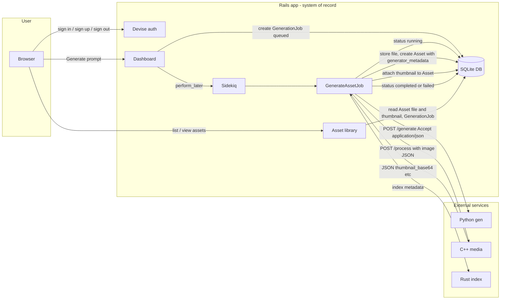

# Data flow

This diagram is updated as the project evolves. Rails is the system of record and the user-facing product.

**Current state:** Users log in via Devise and submit prompts on the dashboard. A `GenerationJob` is created with status `queued` and `GenerateAssetJob` is enqueued in Sidekiq (Redis). The worker marks the job `running`, calls the Python generator service (HTTP POST to `/generate` with `Accept: application/json`), receives JSON `{ image_base64, seed, model }`, decodes the image, stores it in Active Storage, creates an `Asset` with generator_metadata (seed, model) in the Asset’s `metadata` column. If `CPP_MEDIA_URL` is set, the worker POSTs the image to the C++ media service at `/process` (JSON with image_base64 and options); cpp_media returns JSON with `thumbnail_base64` and `thumbnail_content_type`; the worker attaches the thumbnail to the Asset. If `CPP_MEDIA_URL` is not set but `MEDIA_SERVICE_COMMAND` is set, the worker runs the C++ media command (CLI) with env `INPUT_PATH`, `ASSET_ID`, `PROMPT` (no thumbnail attachment). The worker then optionally runs the Rust index service (CLI) and marks the job `completed` or `failed` with `error_message`. Job statuses: queued → running → completed | failed. The asset library and asset detail pages read each Asset’s `file` and `thumbnail` from Active Storage; thumbnails are displayed when present.
