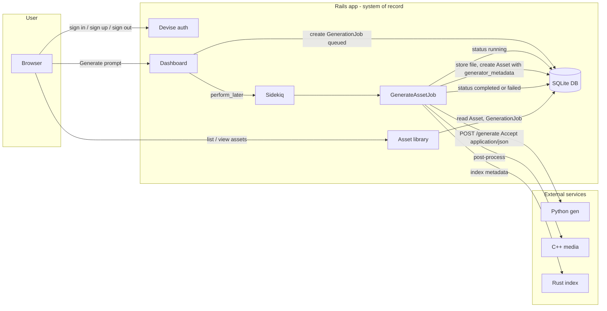

# Data flow

This diagram is updated as the project evolves. Rails is the system of record and the user-facing product.

**Current state:** Users log in via Devise and submit prompts on the dashboard. A `GenerationJob` is created with status `queued` and `GenerateAssetJob` is enqueued in Sidekiq (Redis). The worker marks the job `running`, calls the Python generator service (HTTP POST to `/generate` with `Accept: application/json`), receives JSON `{ image_base64, seed, model }`, decodes the image, stores it in Active Storage, creates an `Asset` with generator_metadata (seed, model) in the Asset’s `metadata` column, optionally runs the C++ media service (CLI) and Rust index service (CLI), then marks the job `completed` or `failed` with `error_message`. Job statuses: queued → running → completed | failed. Python, C++, and Rust services are configurable via ENV; the pipeline skips C++/Rust steps if their commands are not set. The Python service implements `POST /generate` (raw image by default; JSON with `image_base64`, `seed`, and `model` when `Accept: application/json`) and `GET /health`.
